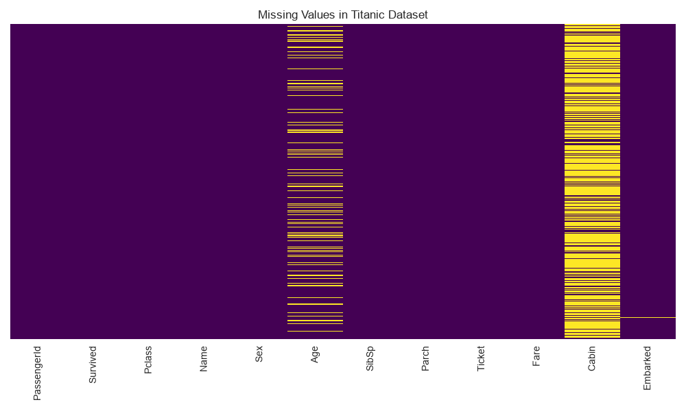
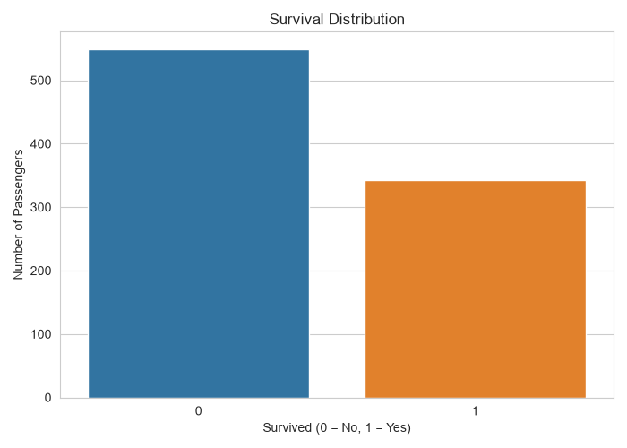
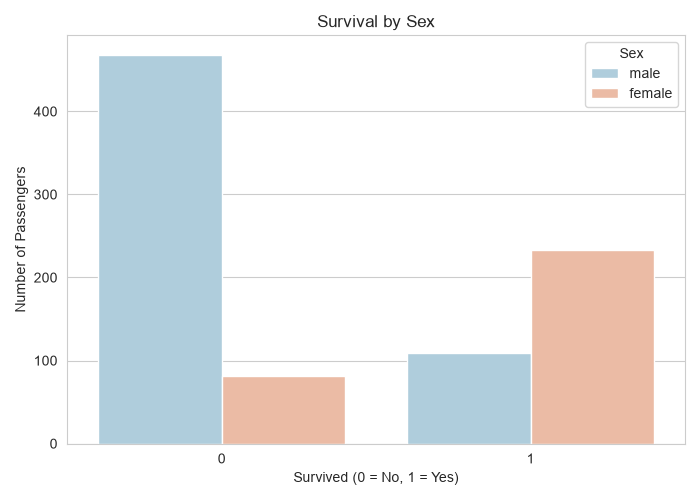
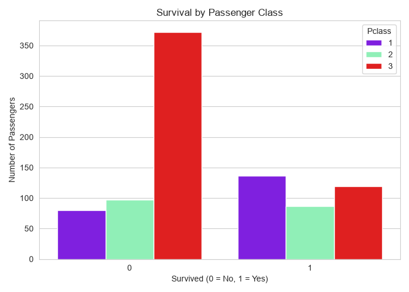
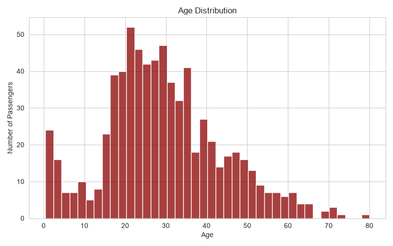
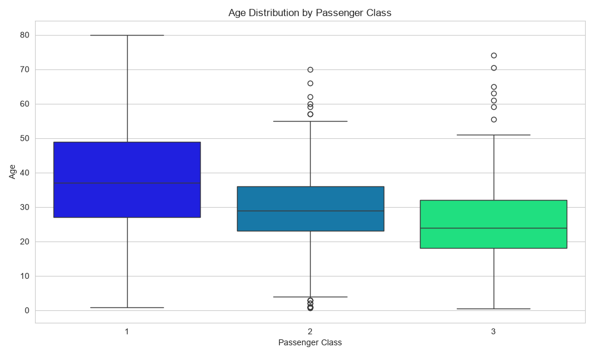
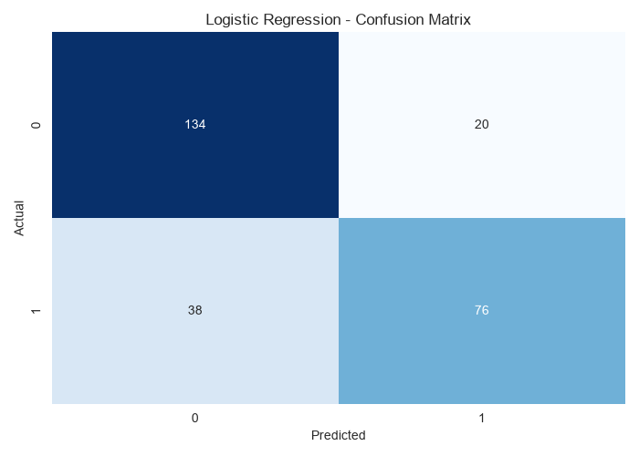

# Titanic Survival Analysis & Logistic Regression

## Overview

This project explores the Titanic passenger dataset using **Exploratory Data Analysis (EDA)**, data preprocessing, and machine learning.

The main goal is to analyze the factors associated with passenger survival and build a **Logistic Regression classification model** that predicts whether a passenger survived the Titanic disaster.

The project demonstrates a complete basic machine learning workflow, including data exploration, visualization, handling missing values, categorical feature encoding, model training, prediction, and evaluation.

---

## Technologies Used

- Python
- Pandas
- Matplotlib
- Seaborn
- Scikit-learn

---

## Dataset

The dataset contains information about **891 Titanic passengers** and includes 12 original features.

Some of the most important variables are:

| Feature | Description |
|---|---|
| `Survived` | Survival status (0 = No, 1 = Yes) |
| `Pclass` | Passenger class (1st, 2nd, or 3rd) |
| `Sex` | Passenger gender |
| `Age` | Passenger age |
| `SibSp` | Number of siblings/spouses aboard |
| `Parch` | Number of parents/children aboard |
| `Fare` | Ticket fare |
| `Embarked` | Port of embarkation |

The target variable used for prediction is **`Survived`**.

---

## Exploratory Data Analysis

Before building the model, the dataset was explored using several visualizations.

### Missing Values

The initial dataset contained missing values, especially in the `Age` and `Cabin` columns.



### Survival Distribution

The dataset contains more passengers who did not survive than passengers who survived.



### Survival by Sex

Passenger survival differed considerably between male and female passengers.



### Survival by Passenger Class

Survival also varied across passenger classes.



### Age Distribution

Most passengers were young and middle-aged adults, while fewer passengers belonged to older age groups.



### Age by Passenger Class

Passenger age distributions were analyzed across passenger classes to help handle missing `Age` values.



---

## Data Preprocessing

Several preprocessing steps were performed before training the machine learning model.

### Handling Missing Age Values

The `Age` column originally contained **177 missing values**.

Instead of removing these passengers, missing ages were filled based on passenger class using representative age values:

- 1st Class → 37 years
- 2nd Class → 29 years
- 3rd Class → 24 years

This approach preserves more observations while taking passenger class into account.

### Handling Missing Embarked Values

The `Embarked` column contained **2 missing values**.

These missing values were filled using the most frequent port of embarkation (mode) in the dataset.

### Removing the Cabin Feature

The `Cabin` column contained a large number of missing values and was therefore removed from the dataset.

### Removing Unnecessary Features

The following columns were not used as model features:

- `PassengerId`
- `Name`
- `Ticket`
- `Cabin`

### Encoding Categorical Variables

Machine learning models require numerical input.

The categorical variables:

- `Sex`
- `Embarked`

were converted into numerical dummy variables using one-hot encoding.

After preprocessing, the dataset used for modeling contained the following columns:

```text
Survived
Pclass
Age
SibSp
Parch
Fare
male
Q
S
```

---

## Train-Test Split

The dataset was divided into:

- **70% training data**
- **30% testing data**

The training set was used to train the Logistic Regression model, while the test set was used to evaluate its performance on unseen data.

A fixed `random_state=101` was used to make the split reproducible.

---

## Logistic Regression Model

A **Logistic Regression** model was used because the target variable represents a binary classification problem:

```text
0 → Passenger did not survive
1 → Passenger survived
```

The model was trained using the training features and their corresponding survival outcomes.

After training, predictions were generated for the test dataset.

---

## Model Evaluation

The model was evaluated using:

- Accuracy
- Confusion Matrix
- Precision
- Recall
- F1-score

### Accuracy

The Logistic Regression model achieved an accuracy of:

**78.36%**

This means that approximately 78% of passengers in the test dataset were classified correctly.

---

## Confusion Matrix

The resulting confusion matrix was:

```text
[[134  20]
 [ 38  76]]
```

This corresponds to:

- **134 True Negatives** — correctly predicted non-survivors
- **20 False Positives** — predicted as survivors but did not survive
- **38 False Negatives** — predicted as non-survivors but actually survived
- **76 True Positives** — correctly predicted survivors



---

## Classification Report

| Class | Precision | Recall | F1-Score | Support |
|---|---:|---:|---:|---:|
| Did not survive (0) | 0.78 | 0.87 | 0.82 | 154 |
| Survived (1) | 0.79 | 0.67 | 0.72 | 114 |
| **Accuracy** | | | **0.78** | **268** |

The model performs better at identifying passengers who **did not survive**, with a recall of **0.87**, compared with a recall of **0.67** for passengers who survived.

---

## Project Workflow

The project follows the following machine learning workflow:

1. Load the Titanic dataset
2. Inspect the dataset and identify missing values
3. Perform exploratory data analysis
4. Visualize survival patterns and passenger characteristics
5. Handle missing `Age` values
6. Remove features with excessive missing data
7. Encode categorical variables
8. Separate features and target variable
9. Split the dataset into training and testing sets
10. Train a Logistic Regression model
11. Generate predictions
12. Evaluate model performance

---

## Project Structure

```text
Titanic-Dataset/
│
├── images/
│   ├── age_distribution_pclass.png
│   ├── age_distribution.png
│   ├── confusion_matrix.png
│   ├── missing_values_preview.png
│   ├── survival_by_pclass.png
│   ├── survival_by_sex.png
│   └── survival_distribution.png
│
├── titanic_analysis.py
├── titanic_dataset.csv
├── README.md
├── requirements.txt
└── .gitignore
```

---

## How to Run the Project

Clone the repository and install the required Python libraries:

```bash
pip install -r requirements.txt
```

Then run:

```bash
python titanic_analysis.py
```

The script will perform the analysis, display the visualizations, train the Logistic Regression model, and print the model evaluation results.

---

## Possible Future Improvements

The project could be extended by:

- Applying feature scaling
- Creating additional features such as family size
- Exploring passenger titles extracted from names
- Comparing Logistic Regression with other classification algorithms
- Performing hyperparameter tuning
- Using cross-validation for more robust model evaluation

---

## Conclusion

This project demonstrates a complete introductory machine learning workflow using the Titanic dataset.

After data exploration and preprocessing, a Logistic Regression classifier achieved **78.36% accuracy** on the test dataset.

The analysis also demonstrates how exploratory data analysis and data preprocessing can be combined with a classification model to transform raw passenger data into meaningful predictions.